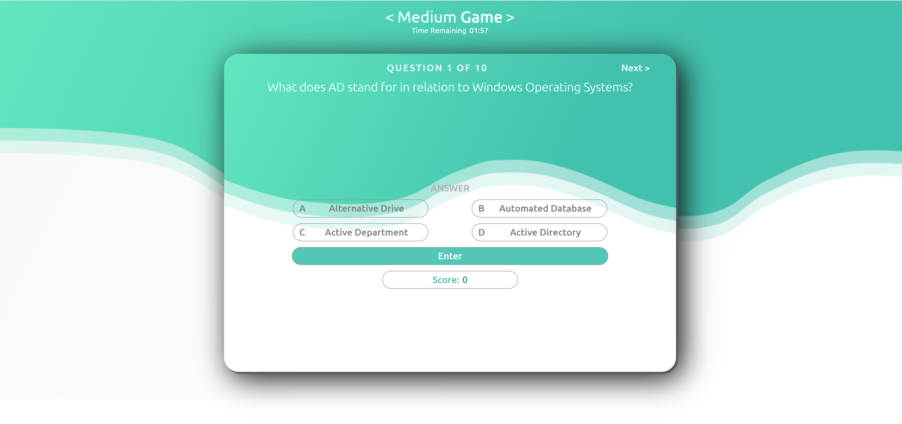

# QuizApplication

A timed quiz application on JavaScript fundamentals that stores high scores

## Introduction

This application uses javascript to manipulate the DOM while a user takes a quiz.

## App functioning

```
GIVEN I am taking a code quiz
WHEN I click the start button
THEN a timer starts and I am presented with a question
WHEN I answer a question
THEN I am presented with another question
WHEN I answer a question incorrectly
THEN time is subtracted from the clock
WHEN all questions are answered or the timer reaches 0
THEN the game is over
WHEN the game is over
THEN I can save my initials and score
```

### Built With

-   HTML

-   CSS

-   JavaScript




## Web Site Link

https://volodymyrbaisa.github.io/HW-Quiz-App/
